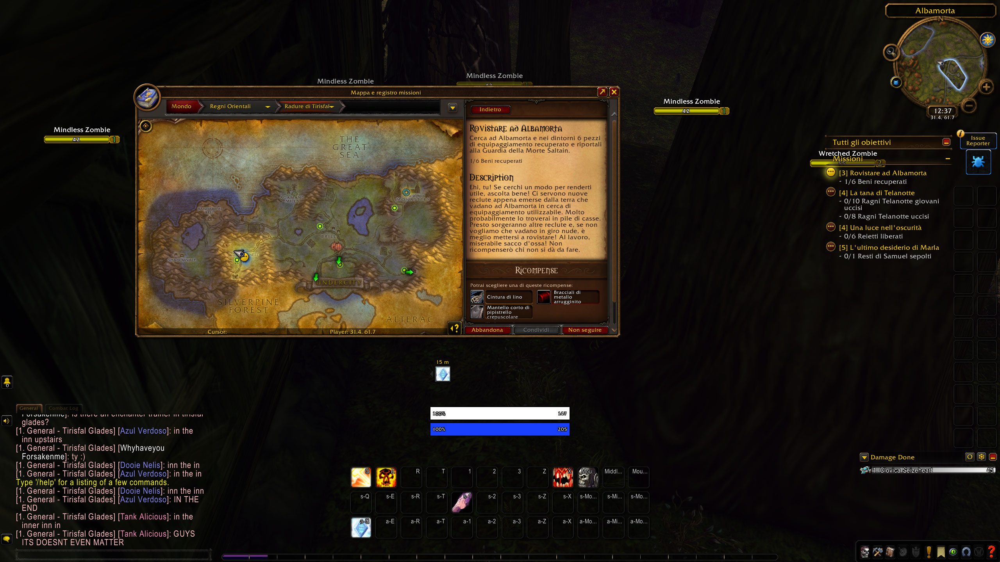
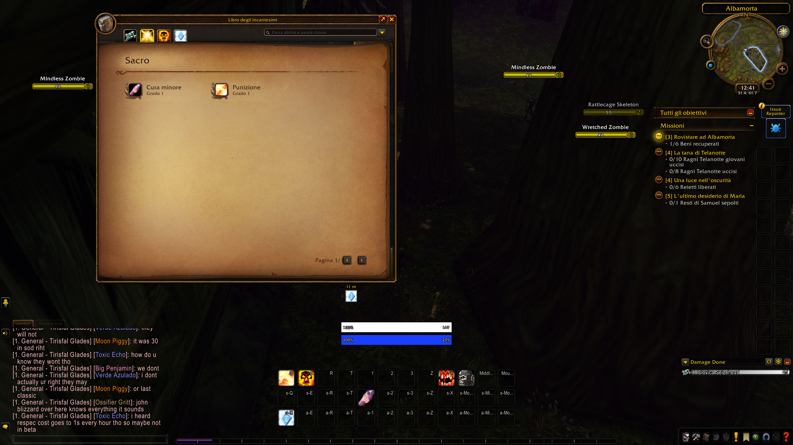

# WOW Forver - Italiano

An open-source, offline Italian translation addon for **World of Warcraft: Forever**. This repository targets the **Forever beta client (interface 16001)**. Translation packs are kept separate from the display code so they can be extended as the beta and new game content change.

## Current beta coverage

Version **0.2.0-beta** contains 1,180 distinct interface label keys, 98 quest IDs, 49 item IDs, and 223 spell IDs. The interface packs include character, reputation, skills, guild, collections, settings, Edit Mode, professions, and other client panels. Many quest entries contain only a title; dialogue, objectives, and rewards have been translated for selected quests whose source text was found in the beta cache or checked against a source. The client is still English, so unhandled text stays English. Use `/wfi status` in game to see loaded entry counts.

This beta pack is **not a complete Italian localization**. The local quest cache contained 50 quest records, including only 10 with titles already catalogued in the addon; other quests and new server content are still missing. Some combat UI, nameplates, map artwork, audio, cinematics, player chat, third-party addons, server messages, and unencountered content can still appear in English. Classic-sourced quest entries are applied only when their live title matches the recorded source, so a reused beta ID cannot show unrelated Italian dialogue. The addon does not translate arbitrary text automatically during play and does not contact an AI service.

## Install on the Forever beta

1. Download [the beta ZIP](dist/WOWForverItaliano-0.2.0-beta.zip) or build it using `tools/build-release.ps1`.
2. Extract its `WOWForverItaliano` folder into `World of Warcraft/_classic_beta_/Interface/AddOns/`.
3. Enable **WOW Forver - Italiano** in the game's AddOns screen, then type `/reload`.
4. Type `/wfi status` to check the loaded translation counts.

The folder must contain `WOWForverItaliano.toc` directly; avoid an extra nested folder. This package is for Forever beta 1.60.x, not Retail or old Classic clients.

## Commands

| Command | Action |
| --- | --- |
| `/wfi status` | Show version and translation counts |
| `/wfi on` | Enable translations |
| `/wfi off` | Disable translations; `/reload` restores already rendered English text |
| `/wfi capture on` | Save encountered quest, item, and spell source text locally |
| `/wfi capture off` | Stop recording source text |
| `/wfi audit globals` | Save this client's exact UI globals locally for source review |
| `/wfi audit visible` | Save visible text from selected Blizzard panels locally |

Capture and audits are **off by default**. Captured data stays in the client's local `WTF/Account/.../SavedVariables/WOWForverItaliano.lua` file and is never sent by the addon. Run `/reload` after an audit to write it to disk. Do not upload the full SavedVariables file publicly; copy only the relevant source strings into a contribution issue.

## Contribute translations

Quest entries are indexed by quest ID in [`Addon/Data/Quests.lua`](Addon/Data/Quests.lua) and the other quest packs. Item and spell entries live in [`Addon/Data/Items.lua`](Addon/Data/Items.lua) and the `Spells*.lua` packs. Interface translations are in the remaining `Addon/Data` files. [`CONTRIBUTING.md`](CONTRIBUTING.md) describes the source and review rules. [`tools/extract_questcache_text.py`](tools/extract_questcache_text.py) can inventory verbatim cache fragments by quest ID, but its output does not identify each fragment's role and must be reviewed manually. [`tools/check-client-ui-source.py`](tools/check-client-ui-source.py) checks UI keys against a local client global audit. Translation work used GPT Luna agents and still needs in-game proofreading as Forever changes.

## License and attribution

Original addon code and project artwork are MIT licensed; see [LICENSE](LICENSE). WoW and World of Warcraft are Blizzard Entertainment trademarks. This community addon is not affiliated with or endorsed by Blizzard. Blizzard game text and other third-party material retain their respective owners' rights; the MIT grant covers only material the contributors can license.
